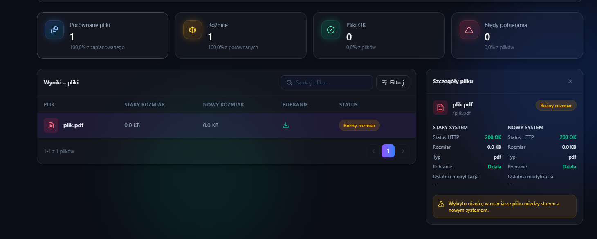

Założenia projektu – BIP Compare
Cel projektu
W związku z rozwojem nowej wersji systemu BIP XE, która zastępuje dotychczasową aplikację desktopową BIP.exe odpowiedzialną za wprowadzanie, zarządzanie oraz publikację informacji w serwisach Biuletynu Informacji Publicznej (BIP), powstała potrzeba stworzenia narzędzia umożliwiającego weryfikację poprawności procesu migracji danych.

Nowy system BIP XE wykorzystuje bazę danych PostgreSQL, podczas gdy dotychczasowe rozwiązanie (BIP2) oparte jest o bazę Firebird. Równolegle opracowano narzędzie do migracji danych pomiędzy tymi systemami. Ze względu na różnice w modelach danych oraz przekształcenia wykonywane podczas migracji, proces ten nie stanowi prostego odwzorowania 1:1.

Uzasadnienie
Aby zapewnić wysoką jakość migracji oraz zminimalizować ryzyko utraty lub nieprawidłowej prezentacji danych, niezbędne jest narzędzie pozwalające na automatyczne porównanie działania serwisów BIP przed i po migracji.

Celem porównania jest identyfikacja wszelkich różnic pomiędzy serwisem źródłowym (BIP2) a serwisem utworzonym w oparciu o BIP XE.

Założenia funkcjonalne
Program BIP Compare powinien:

przyjmować jako dane wejściowe adres URL serwisu źródłowego (BIP2) oraz odpowiadającego mu serwisu po migracji (BIP XE),
automatycznie przeanalizować strukturę obu serwisów i odnaleźć wszystkie dostępne podstrony,
porównać odpowiadające sobie strony pod względem prezentowanej zawartości,
wykrywać różnice dotyczące treści, struktury dokumentów, załączników, odnośników oraz wyglądu stron,
generować czytelny, interaktywny raport zawierający listę wszystkich wykrytych rozbieżności wraz z odnośnikami,
umożliwiać ocenę każdej wykrytej różnicy pod kątem jej akceptowalności lub zakwalifikowania jako błędu wymagającego poprawy procesu migracji.

Zakres porównania
Porównanie powinno obejmować wszystkie strony odnalezione w obu serwisach oraz analizować następujące elementy:

Zawartość strony (HTML)
porównanie treści publikowanych na stronach,
porównanie struktury dokumentu HTML,
wykrywanie brakujących lub dodatkowych elementów treści,
identyfikacja różnic w formatowaniu mających wpływ na prezentację informacji.

Linki
porównanie wszystkich odnośników znajdujących się na stronie,
wykrywanie brakujących lub dodatkowych linków,
sprawdzenie poprawności działania odnośników (status odpowiedzi HTTP),
identyfikacja różnic.

Załączone pliki
porównanie listy załączników przypisanych do strony,
weryfikacja nazw plików,
porównanie rozmiaru plików i kolejności na stronie.

Zrzuty ekranu
wykonanie zrzutów ekranu odpowiadających sobie stron w obu serwisach,
wizualne porównanie wyglądu stron,
wykrywanie różnic w układzie elementów, formatowaniu oraz prezentacji treści,
dołączenie zrzutów ułatwiających analizę wykrytych rozbieżności.

Raport z porównania
Wyniki działania programu powinny zostać przedstawione w postaci interaktywnego raportu umożliwiającego szybkie przejście do każdej wykrytej niezgodności.

Dla każdej różnicy raport powinien zawierać co najmniej:

adres strony w serwisie źródłowym,
adres odpowiadającej strony w serwisie po migracji,
kategorię wykrytej różnicy,
opis niezgodności,
zrzuty ekranu obu stron,
możliwość przejścia do porównywanych stron bezpośrednio z raportu.

Oczekiwane rezultaty
Narzędzie BIP Compare ma stanowić element procesu kontroli jakości migracji danych pomiędzy systemami BIP2 i BIP XE. Wyniki porównania będą wykorzystywane do:

identyfikacji błędów i niezgodności powstałych podczas migracji,
weryfikacji poprawności działania narzędzia migracyjnego,
doskonalenia procesu migracji przed wdrożeniami u kolejnych klientów,
skrócenia czasu niezbędnego na ręczną weryfikację poprawności migracji,
zwiększenia pewności, że serwis BIP po migracji prezentuje informacje zgodne z serwisem źródłowym.

Więcej informacji na powyższych wizualizacjach.
